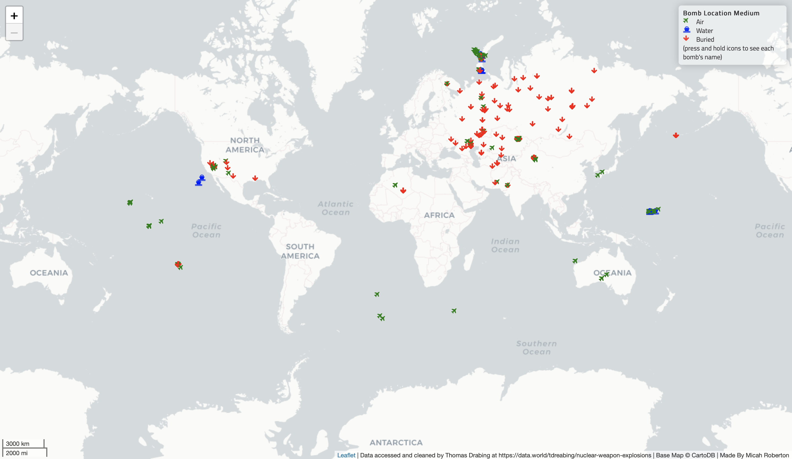

# Nuclear Explosion Locations Map

**Author:** Micah Roberton

The webpage for the map can be accessed here: https://micahroberton.github.io/Nuclear_Map/

**Description**

This map uses Leaflet to show nuclear explosion locations across the world from 1945-1998. Explosions that were delivered from an airdrop via plane are marked with a plane icon. Explosions that were buried underground and then detonated are marked by a down arrow. Finally explosions that were detonated in water are marked by a ship. The larger the bomb's max yield the more red the icon is.

**Goal**

This map was made to aid users in understanding the sheer amount of nuclear blasts our earth has endured in only 50 years. Many viewers will be astonished there are 2,041 blasts recorded on this map. Concentrated sites like southern Nevada and Severny Island above Russia reveal the vast extent of testing that the general public is unaware of. Nuclear weapons threaten our existence with their own existence, this map seeks to show the extend of this threat and draw scale to the issue.

**Resources**

Libraries: Leaflet,cloudflare,googleapis, Github Pages.

Cleaned data is acquired from Thomas Drabing at https://data.world/tdreabing/nuclear-weapon-explosions.

Data Source: https://www.ldeo.columbia.edu/~richards/my_papers/WW_nuclear_tests_IASPEI_HB.pdf

Icons: https://fontawesome.com

**Design**

This map was developed after the author read Command and Control: Nuclear Weapons, the Damascus Accident, and the Illusion of Safety a Book by Eric Schlosser.

The Map was first developed as a tile map in QGIS however the duration of processing so many tiles was not within this project's time scope which pivotted the project towards leaflet HTML using GeoJSON. This meant giving up the blast representation via a shaded radius in corespondance to the bomb's maximum yield.

To get the data into GeoJSON formatting the CSV files were converted using an online file converter application. The original CSV was cleaned and stored on an opensource dataset website called 'Data.World'. The orginal data came from a scholarly journal from Columbia University.

Here is the original tile map I began with.

Here is the final web map product via the GeoJSON solution.

